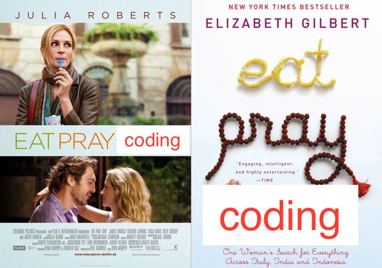

# 코딩중심사회

#### 코딩중심사회 선언문

사회가 소프트웨어 중심사회로 발전하고 있다.
우리는 이러한 변화에 적응하고 미래 먹거리를 창출하기 위해 노력할 것이다.
그것의 시작은 코딩을 배우는 것이다.

#### SW 중심사회란? ([유투브 링크](https://www.youtube.com/watch?v=IxnTqkSmH9k))

## 토요일 오전 10시

코딩하기, 배우기 가장 좋은 2시간

#### 먹고 기도하고 코딩하라

## 파이썬 머신러닝 인사이트

코딩중심사회 3기 머신러닝 인사이드 26일부터 시작합니다. 머신러닝의 개념부터 시작해 활용까지 머신러닝으로의 여행을 시작합니다. 이번에는 5주간 짧게 진행합니다. 짧은 시간내에 많은 내용은 다룰 수 없기에 머신러닝의 한가지 모델을 정해놓고 그 이해와 활용까지 파해치는 것을 목표로 합니다.

물론 이전에 그랬던 것처럼 라이브코딩으로 진행합니다. 머신러닝을 하나도 몰라도 상관없습니다. 단 컴퓨터에 파이썬3와 주피터는 설치하고 오셔야 합니다.

이번 스터디는 5주간의 장소대여료 및 운영비용을 시작 시점에 받을 예정입니다. 준비해서 오시면 고맙겠습니다.
5주간의 스터디 함께 달려봅시다!!

PS. 참석 지원은 저에게 메시지 남겨주시거나 koo@getswizzle.com 메일로 신청해주시기 바랍니다.

### 머신러닝 인사이드 커리큘럼

- Install scikit-learn : scikit learn 설치하기
- Training Data and Test Data : 학습 데이터와 데스트 데이터
- What is the Model? : 모델이란?
- What is the Regression? : 회귀란?
- Definitions of mean, variance, arg-max, likelihood, etc... : 각종 용어들 학습하기
- Drawing scatter plot : 스케터 플롯 그리기
- Implementing simple classification model : 간단한 분류 모델 구현하기

## 파이썬 오픈스터디 (데이터 수집 분석 기초)
- 1st Week : 개발 툴 설치 및 Python으로 프로그램 돌려보기
- 2nd Week : Python으로 데이터 구조 및 로직 만들기 & Python으로 파일 입출력 구현하기
- 3rd Week : Python으로 데이터 수집하기 (1) - API 로 데이터 수집
- 4th Week : Python으로 데이터 수집하기 (2) - 웹페이지 데이터 수집
- 5th Week : Python으로 데이터 수집하기 (3) - 고급 웹페이지 데이터 수집
- 6th Week : 분석 알고리즘 설계하기
- 7th Week : 분석 알고리즘 구현하기
- 8th Week : 분석 결과 실제 서비스에 적용하기

## 사수 소개
- 이용구
- 바로풀기, 스위즐랩스 창업맴버
- 데이터, 인공지능분야 박사과정 수료 
- Java, Python 개발자
- [사수 블로그 링크](https://kuleeblog.wordpress.com)
- 이메일 : koo@getswizzle.com
